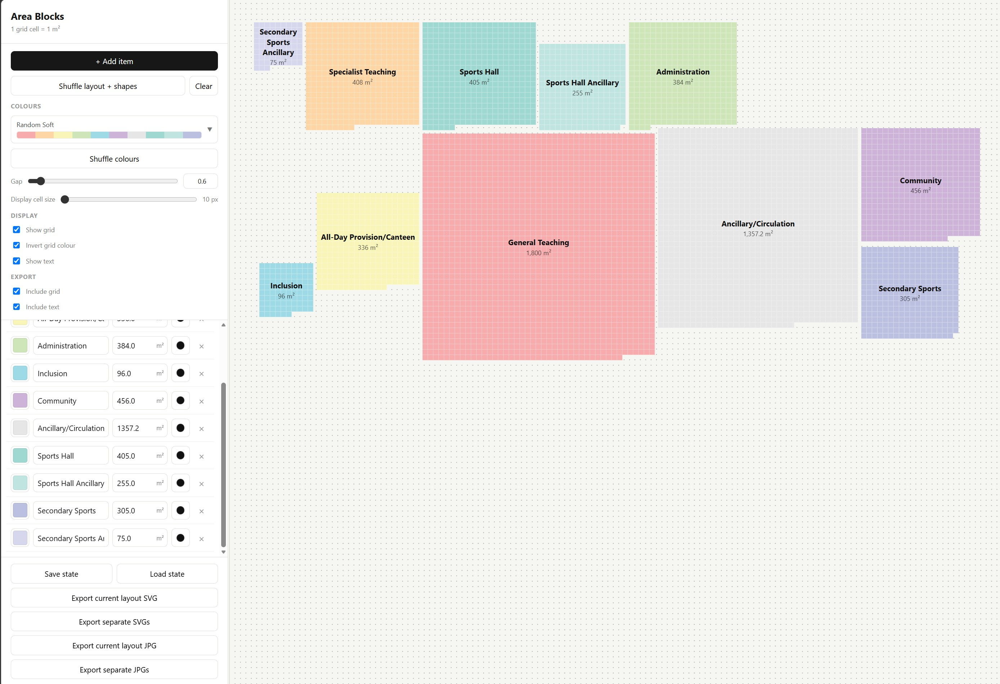

# Area Blocks

Area Blocks is a lightweight browser-based tool for quickly visualising programme areas as proportional 1 m² grid blocks.

## Features

- Add, rename, recolour and remove programme areas
- Enter areas in m²
- Automatically generate proportional block shapes
- Shuffle layouts and colours
- Multiple built-in colour palettes
- Optional grid and room labels
- Light and dark modes
- Adjustable display scale and spacing
- Export the complete layout as SVG or JPG
- Export individual rooms as SVG or JPG ZIP archives
- Save and reload projects as JSON
- Automatically restore the last browser session

## Usage

Open `index.html` in a modern web browser. No installation or server is required.

Add rooms and enter their required areas. Use **Shuffle layout + shapes** to explore different arrangements and **Shuffle colours** or the palette selector to adjust the graphic appearance.

Use **Save State** to save the current project as a JSON file. A saved state can later be restored using **Load State**.

Export options allow either the complete arrangement or each individual room to be exported for use in other drawing and graphics software.

## Units

**1 grid cell = 1 m²**

The display cell size only changes the visual scale of the diagram; it does not change the represented areas.
